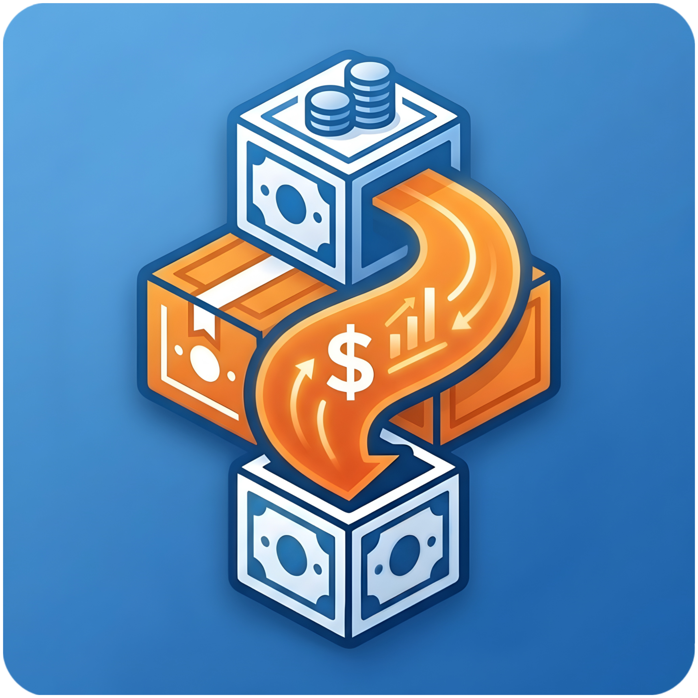
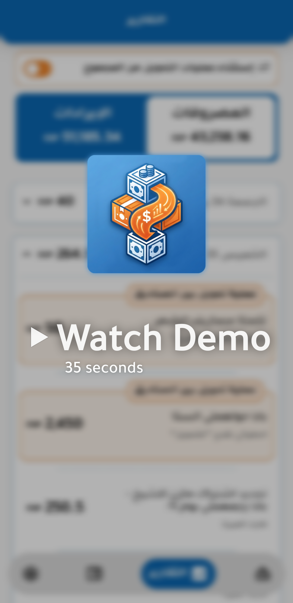
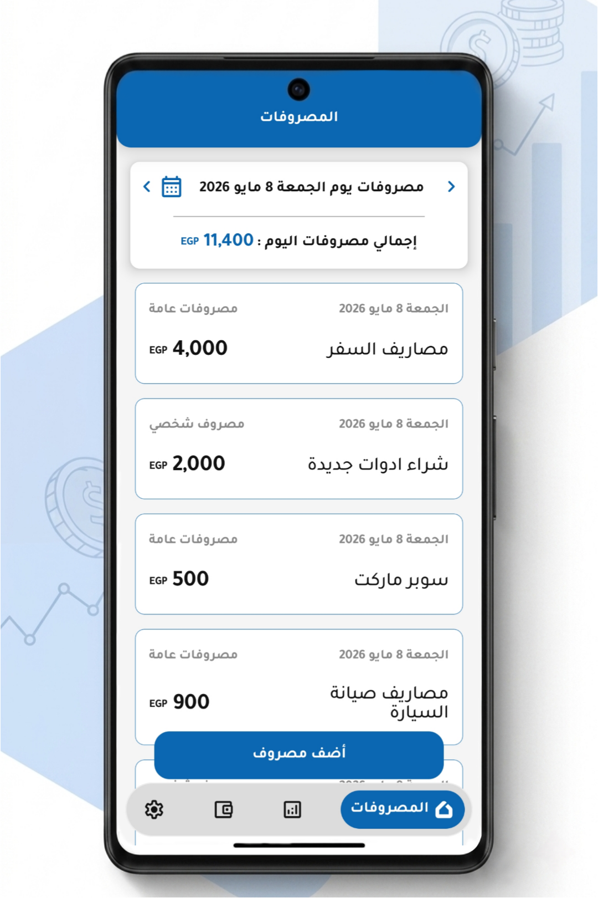
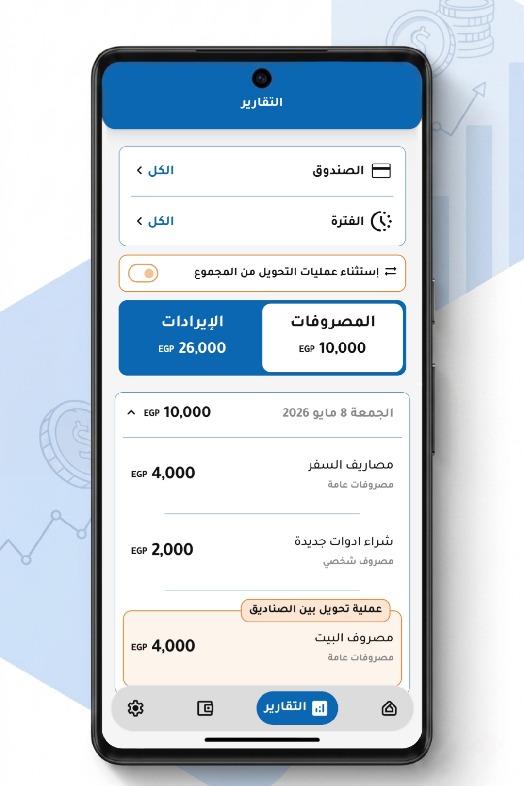
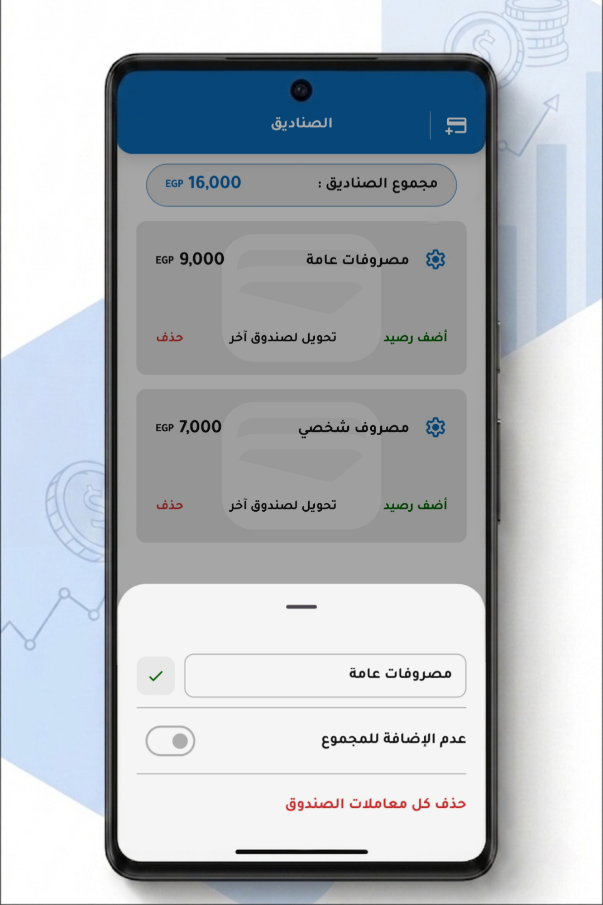
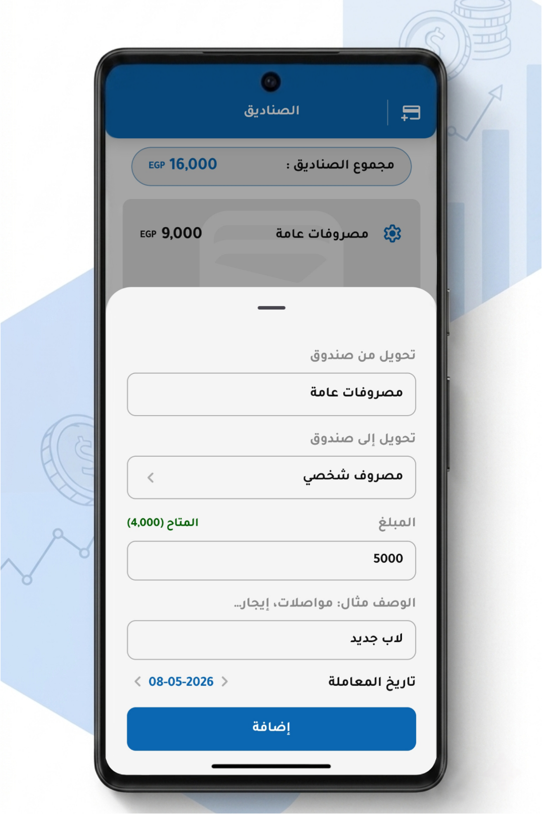
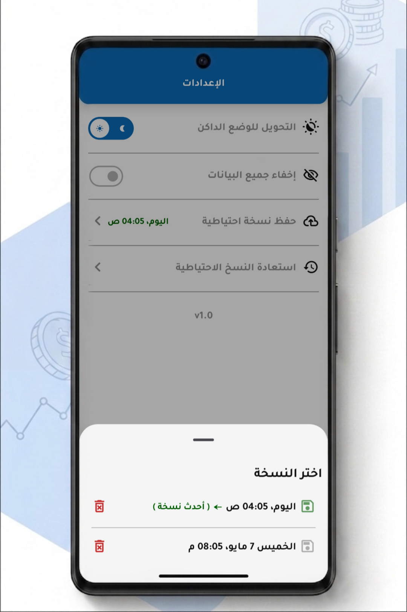
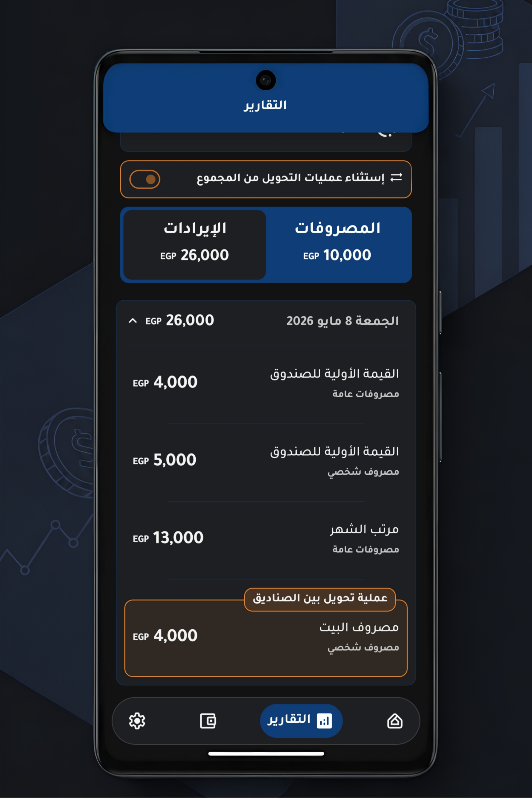
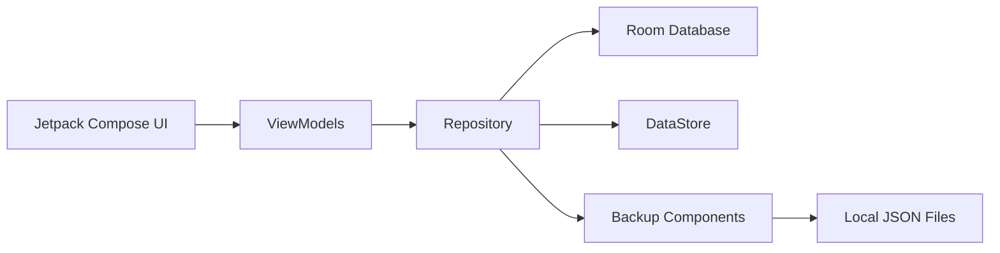

<div align="center">

<p align="center">
  
</p>

# Fund Flow

### Privacy-first personal finance management, built for Android and designed to work entirely offline.


**Published on Google Play • Offline-first • Privacy-first**

[](https://play.google.com/store/apps/details?id=com.axoncodelabs.fundflow)

</div>

---

## Overview

**Fund Flow** is an offline personal finance application that helps users manage multiple funds, track expenses, transfer balances, generate financial reports, and back up their data locally without requiring an internet connection or user account.

Fund Flow is a production Android application released on Google Play, built with a focus on predictable state management, local-first architecture, and production-oriented engineering practices.

---

## Why Fund Flow?

Many personal finance applications rely on cloud services or user accounts while requiring users to trust external servers with sensitive financial data.

Fund Flow was built to demonstrate that a modern Android application can provide a complete finance management experience while keeping all user data entirely on the device.

---

## Demo

<p align="center">
  <a href="docs/media/demo-gif.gif">
    
  </a>
</p>

---

## Screenshots

<table>
<tr>

<td align="center">

<br/>
<b>Expenses</b>
</td>

<td align="center">

<br/>
<b>Reports</b>
</td>

<td align="center">

<br/>
<b>Edit Fund</b>
</td>

</tr>

<tr>

<td align="center">

<br/>
<b>Transfer</b>
</td>

<td align="center">

<br/>
<b>Backups</b>
</td>

<td align="center">

<br/>
<b>Dark Mode</b>
</td>

</tr>
</table>

---

## Core Features

- Manage multiple funds independently
- Record income and expense transactions
- Transfer balances between funds
- Generate reports by fund and date range
- Include or exclude transfers from reports
- Create and restore local JSON backups
- Separate manual and automatic backup workflows
- Hide sensitive financial information
- Light & Dark themes
- Fully offline experience

---

## Architecture Principles

Fund Flow was designed around a small set of engineering principles that guided every architectural decision throughout the project.

### Single Source of Truth

The Repository Pattern acts as the central coordination layer for business rules, financial operations, and data access, preventing duplicated logic across the application.

---

### Reusable Business Rules

Core transaction-processing logic is shared across transaction creation, updates, deletions, and fund transfers instead of maintaining multiple implementations for similar operations.

---

### Reactive State Propagation

Application state is modeled using Flow and StateFlow, allowing UI components to react automatically to local data changes without manual synchronization.

---

### Local-first Architecture

All financial data remains on the user's device. The application requires neither user accounts nor cloud services, ensuring privacy and full offline functionality.

---

### Separation of Concerns

UI rendering, state management, business logic, persistence, preferences, and backup responsibilities are isolated into dedicated layers and components.

---

## UI & Visual Design

Fund Flow was designed with a consistent visual identity and reusable UI components to keep the interface clean, cohesive, and easy to navigate across both light and dark themes.

Special care was given to spacing, typography, and visual balance to make reviewing financial information comfortable during everyday use.

Although the interface is intentionally simple, it supports complex financial workflows through a straightforward user experience. Behind the scenes, the presentation layer is structured around reusable composables, reactive state management, and clear separation of responsibilities, keeping the codebase maintainable and scalable.

---

## Engineering & Implementation

### Reactive Reporting Pipeline

Reports are driven by a reactive query model built from multiple changing inputs, including the selected fund, reporting period, and available transaction range.

Whenever one of these inputs changes, the active report filter is recomputed and downstream Flows automatically switch to the appropriate Room query, keeping the UI synchronized without manual refreshes.

Implementation excerpt:

```kotlin
private val queryFilterFlow = combine(
    selectedFundFlow,
    selectedDateFlow,
    initialDateRange
) { fund, selectedDate, dbRange ->

    val (startDate, endDate) = when {
        selectedDate != null -> {
            selectedDate.startOfMonth() to selectedDate.endOfMonth()
        }

        dbRange.firstDate != null && dbRange.lastDate != null -> {
            dbRange.firstDate.startOfMonth() to dbRange.lastDate.endOfMonth()
        }

        else -> null to null
    }

    QueryFilter(
        fund = fund,
        startDate = startDate,
        endDate = endDate
    )

}
    .distinctUntilChanged()
    .onEach { clearExpandedDays() }
```

The resulting `QueryFilter` is consumed with `flatMapLatest`, allowing the active Room query to switch automatically whenever the selected report criteria change.

---

### Unified Transaction Processing

Income and expense operations share the same processing pipeline.

Instead of maintaining separate implementations, the repository translates each transaction type into its financial effect and applies a single balance-update algorithm.

This centralizes business rules, reduces duplicated logic, and ensures consistent behavior across transaction creation, updates, deletions, and fund transfers.

Implementation excerpt:

```kotlin
private fun signForType(type: TransactionType): Int =
    when (type) {
        TransactionType.INCOME -> 1
        TransactionType.EXPENSE -> -1
    }

@Transaction
override suspend fun insertTransaction(
    transaction: TransactionEntity
) {
    val fund = getFundOrThrow(transaction.fundId)

    val delta =
        signForType(transaction.type) * transaction.amount

    fundDao.updateFund(
        fund.copy(balance = fund.balance + delta)
    )

    transactionDao.insertTransaction(transaction)
}
```

The same balance-update workflow is reused throughout transaction creation, updates, deletions, and fund transfers, ensuring consistent financial behavior while avoiding duplicated business logic.

---

### Balance Reconciliation

Updating an existing transaction requires more than replacing database values.

The repository compares the previous and updated transaction states, computes the required balance adjustment, and applies only the resulting financial delta.

Whether the transaction amount, type, or associated fund changes, cached balances remain consistent through centralized reconciliation logic executed inside atomic Room transactions.

---

### Reusable Transfer Workflow

Fund transfers are implemented by composing existing transaction-processing logic rather than introducing a separate balance engine.

A transfer is represented as two related ledger entries:

- an expense transaction from the source fund
- an income transaction to the destination fund

Both entries reuse the same transaction-processing pipeline used throughout the application, avoiding the need for a separate balance engine while ensuring consistent calculations and reporting behavior.

---

### Backup Architecture

Backup responsibilities are separated across dedicated serialization, storage, and coordination components.

Funds and transactions are serialized into local JSON files using Kotlin Serialization. Manual and automatic backups share the same infrastructure while remaining independent in their execution flow.

The backup workflow also:

- replaces automatic backups created on the same date
- limits the number of stored backup files
- synchronizes the latest backup timestamp
- restores application data through a centralized restore workflow

---

### Separation of Responsibilities

- **Compose** renders the UI and forwards user actions.
- **ViewModels** expose and coordinate reactive screen state.
- **Repository** coordinates business rules and financial operations.
- **Room** manages structured local persistence.
- **DataStore** stores application preferences.
- **Backup components** handle serialization and local file management.

---

## Architecture

The application follows an MVVM architecture where the Repository serves as the central coordination layer for business rules, financial operations, persistence, preferences, and backup workflows while exposing reactive data streams to the presentation layer.



---

## Tech Stack

| Area | Technologies |
|------|--------------|
| **Language** | Kotlin |
| **UI** | Jetpack Compose, Material 3 |
| **Architecture** | MVVM, Repository Pattern |
| **Dependency Injection** | Hilt |
| **Database** | Room |
| **Preferences** | DataStore |
| **Asynchronous Programming** | Coroutines, Flow, StateFlow |
| **Serialization** | Kotlin Serialization |
| **Navigation** | Navigation Compose |

---

## Contact

For technical discussions or feedback, feel free to reach out.

[](mailto:axoncodelabs@gmail.com)

Developer:

[](https://www.linkedin.com/in/ahmed-mohamed-android)

---

## License

Copyright © 2026 Ahmed Mohamed — Axon Code Labs.

This repository contains proprietary software and is publicly available for viewing and technical evaluation purposes only.

No permission is granted to use, copy, modify, distribute, publish, sublicense, or create derivative works from any part of this project.

See **[COPYRIGHT.md](COPYRIGHT.md)** for the complete license terms.
